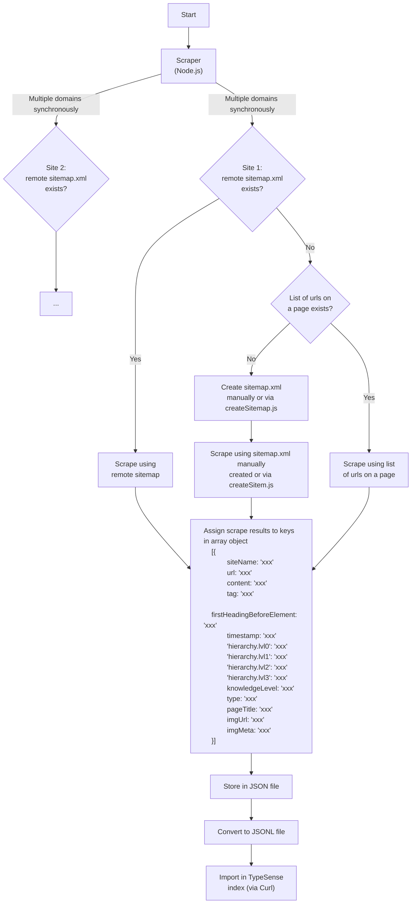

# Create search index

```mermaid

graph TD
    Start -->

    Scraper["Scraper\n(Node.js)"]
    
    Scraper -->|Multiple domains synchronously|N{"Site 1: \n remote sitemap.xml\nexists?"}
    
    Scraper --> |Multiple domains synchronously|M{"Site 2: \n remote sitemap.xml\nexists?"} --> ...
    
    N --> |Yes| B[Scrape using\nremote sitemap]
    
    N --> |No| O{"List of urls on\na page exists?"} 
    
    O --> |Yes| P[Scrape using list\nof urls on a page]

    O --> |No| sdf["Create sitemap.xml\nmanually or via createSitemap.js"]

    sdf --> fgkwiw["Scrape using sitemap.xml manually\ncreated or via createSitem.js"]

    assignKeys["Assign scrape results to keys in array object
    [{
        &nbsp;&nbsp;&nbsp;&nbsp;siteName: 'xxx'
        &nbsp;&nbsp;&nbsp;&nbsp;url: 'xxx'
        &nbsp;&nbsp;&nbsp;&nbsp;content: 'xxx'
        &nbsp;&nbsp;&nbsp;&nbsp;tag: 'xxx'
        &nbsp;&nbsp;&nbsp;&nbsp;firstHeadingBeforeElement: 'xxx'
        &nbsp;&nbsp;&nbsp;&nbsp;timestamp: 'xxx'
        &nbsp;&nbsp;&nbsp;&nbsp;'hierarchy.lvl0': 'xxx'
        &nbsp;&nbsp;&nbsp;&nbsp;'hierarchy.lvl1': 'xxx'
        &nbsp;&nbsp;&nbsp;&nbsp;'hierarchy.lvl2': 'xxx'
        &nbsp;&nbsp;&nbsp;&nbsp;'hierarchy.lvl3': 'xxx'
        &nbsp;&nbsp;&nbsp;&nbsp;knowledgeLevel: 'xxx'
        &nbsp;&nbsp;&nbsp;&nbsp;type: 'xxx'
        &nbsp;&nbsp;&nbsp;&nbsp;pageTitle: 'xxx'
        &nbsp;&nbsp;&nbsp;&nbsp;imgUrl: 'xxx'
        &nbsp;&nbsp;&nbsp;&nbsp;imgMeta: 'xxx'
    }]
"]
style assignKeys text-align: left
    
    B --> assignKeys
    fgkwiw --> assignKeys
    P --> assignKeys
    
    assignKeys --> storeJson["Store in JSON file"]
    storeJson --> storeJsonl["Convert to JSONL file"]
    storeJsonl --> Import["Import in TypeSense\nindex (via Curl)"]
    


```

