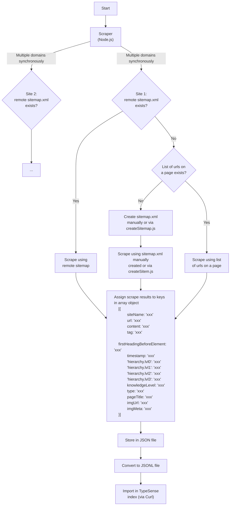

# Create search index

## Fetch the content from various websites.

First we have to fetch the content from various websites.

We use the Puppeteer library. Puppeteer can also process JavaScript, so dynamically added content, like knowledgelevel will also be collected.



## Import into Typesense

In Typesense a “document” is what a “record” is in a database.

More info on the Typesense website: https://typesense.org/docs/0.24.1/api/documents.html#index-multiple-documents

The documents we want to import have to follow a scheme. The current scheme we use is:

```
{
    "created_at": 1686917235,
    "default_sorting_field": "",
    "enable_nested_fields": false,
    "fields": [
        {
            "facet": false,
            "index": true,
            "infix": false,
            "locale": "",
            "name": "url",
            "optional": false,
            "sort": false,
            "type": "string"
        },
        {
            "facet": false,
            "index": true,
            "infix": false,
            "locale": "",
            "name": "content",
            "optional": false,
            "sort": false,
            "type": "string"
        },
        {
            "facet": false,
            "index": true,
            "infix": false,
            "locale": "",
            "name": "timestamp",
            "optional": false,
            "sort": false,
            "type": "string"
        },
        {
            "facet": false,
            "index": true,
            "infix": false,
            "locale": "",
            "name": "hierarchy.lvl0",
            "optional": false,
            "sort": false,
            "type": "string"
        },
        {
            "facet": true,
            "index": true,
            "infix": false,
            "locale": "",
            "name": "hierarchy.lvl1",
            "optional": false,
            "sort": false,
            "type": "string"
        },
        {
            "facet": false,
            "index": true,
            "infix": false,
            "locale": "",
            "name": "hierarchy.lvl2",
            "optional": false,
            "sort": false,
            "type": "string"
        },
        {
            "facet": false,
            "index": true,
            "infix": false,
            "locale": "",
            "name": "hierarchy.lvl3",
            "optional": false,
            "sort": false,
            "type": "string"
        },
        {
            "facet": true,
            "index": true,
            "infix": false,
            "locale": "",
            "name": "knowledgeLevel",
            "optional": false,
            "sort": false,
            "type": "string"
        },
        {
            "facet": true,
            "index": true,
            "infix": false,
            "locale": "",
            "name": "siteName",
            "optional": false,
            "sort": false,
            "type": "string"
        },
        {
            "facet": true,
            "index": true,
            "infix": false,
            "locale": "",
            "name": "tag",
            "optional": true,
            "sort": false,
            "type": "string"
        },
        {
            "facet": true,
            "index": true,
            "infix": false,
            "locale": "",
            "name": "type",
            "optional": false,
            "sort": false,
            "type": "string"
        },
        {
            "facet": true,
            "index": true,
            "infix": false,
            "locale": "",
            "name": "pageTitle",
            "optional": true,
            "sort": false,
            "type": "string"
        },
        {
            "facet": true,
            "index": true,
            "infix": false,
            "locale": "",
            "name": "firstHeadingBeforeElement",
            "optional": true,
            "sort": false,
            "type": "string"
        },
        {
            "facet": true,
            "index": true,
            "infix": false,
            "locale": "",
            "name": "source",
            "optional": true,
            "sort": false,
            "type": "string"
        },
        {
            "facet": true,
            "index": true,
            "infix": false,
            "locale": "",
            "name": "author",
            "optional": true,
            "sort": false,
            "type": "string"
        },
        {
            "facet": false,
            "index": true,
            "infix": false,
            "locale": "",
            "name": "creationDate",
            "optional": true,
            "sort": false,
            "type": "string"
        },
        {
            "facet": true,
            "index": true,
            "infix": false,
            "locale": "",
            "name": "imgUrl",
            "optional": true,
            "sort": false,
            "type": "string"
        },
        {
            "facet": false,
            "index": true,
            "infix": false,
            "locale": "",
            "name": "imgMeta",
            "optional": false,
            "sort": false,
            "type": "string"
        }
    ],
    "name": "WOT-terms-xx",
    "num_documents": xxxxxx,
    "symbols_to_index": [],
    "token_separators": []
}
```

You can create a scheme yourself. For example: the ```imgMeta``` entry is something we chose to create and it contains text around an image. Later on in your client code, you can retrieve this information.