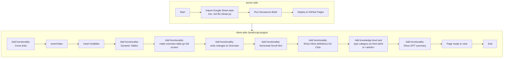

# Docusaurus process

```mermaid

flowchart TD

subgraph server-side
Start

--> A["Import Google Sheet data\ninto .md file (Node.js)"]

A --> B["Run Docsaurus Build"]

B --> C["Deploy to GitHub Pages"]
end

subgraph client-side-JavaScript-plugins
crossLinks["Add functionality:\nCross links"]
--> insertVideo
--> insertSubtitles["Insert Subtitles"]
--> dynamicTables["Add functionality:\nDynamic Tables"]
--> elementGoFullScreen["Add functionality:\nmake overview table go full screen"]
--> writeChanges["Add functionality:\nwrite changes to Overview"]
--> horizontalScrollHint["Add functionality:\nHorizontal Scroll Hint"]
--> showDefinitionsOnClick["Add functionality:\nShow inline definitions On Click"]
--> addDataTypes["Add knowledge level and\ntype category as html attrib\nto &lt;article&gt;"]
--> showGPTsummary["Add functionality:\nShow GPT summary"]
--> PageReady["Page ready to view"]
--> End


end

server-side --> client-side-JavaScript-plugins


```

