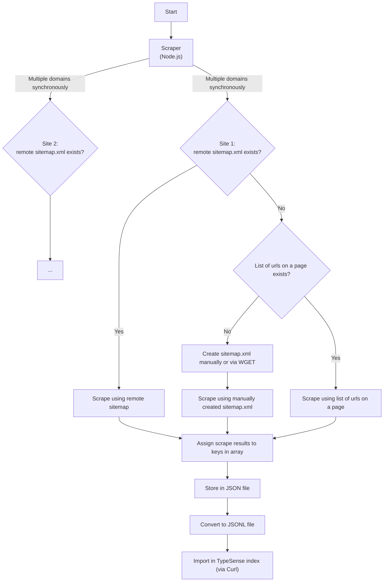

# Create search index

```mermaid

graph TD
    Start -->

    Scraper["Scraper\n(Node.js)"]
    
    Scraper -->|Multiple domains synchronously|N{"Site 1: \n remote sitemap.xml exists?"}
    
    Scraper --> |Multiple domains synchronously|M{"Site 2: \n remote sitemap.xml exists?"} --> ...
    
    N --> |Yes| B[Scrape using remote sitemap]
    
    N --> |No| O{"List of urls on a page exists?"} 
    
    O --> |Yes| P[Scrape using list of urls on a page]

    O --> |No| sdf["Create sitemap.xml manually or via WGET"]

    sdf --> fgkwiw["Scrape using manually created sitemap.xml"]

    assignKeys["Assign scrape results to keys in array"]
    
    B --> assignKeys
    fgkwiw --> assignKeys
    P --> assignKeys
    
    assignKeys --> storeJson["Store in JSON file"]
    storeJson --> storeJsonl["Convert to JSONL file"]
    storeJsonl --> Import["Import in TypeSense index (via Curl)"]
    


```

