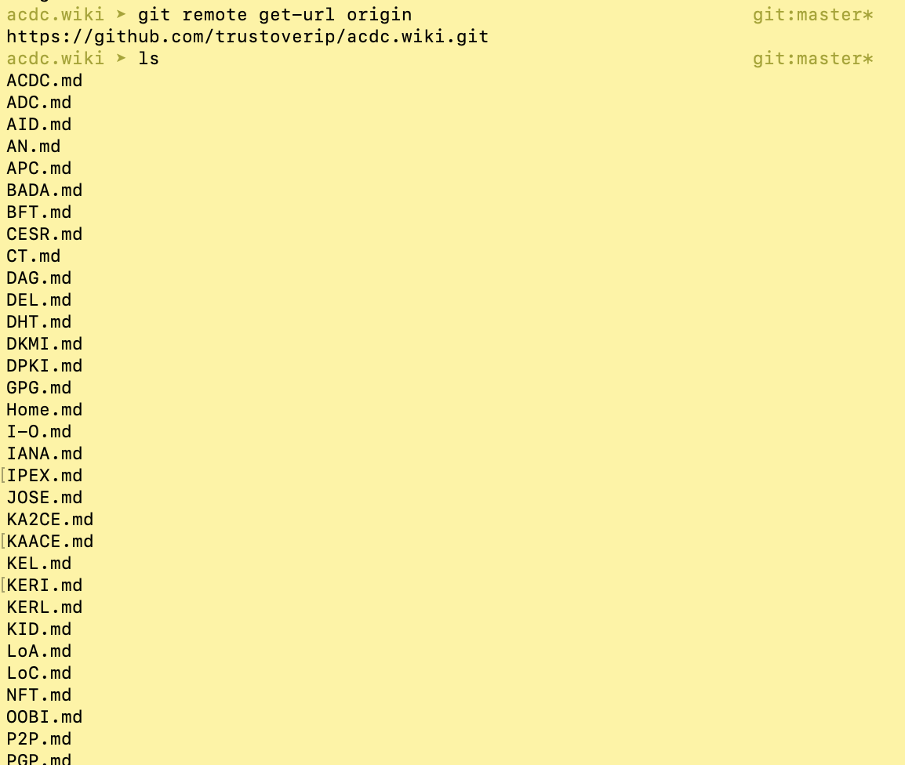

# Load ToIP glossary in weboftrust github page

## Input

1. The ToIP ACDC glossary locally (all the .md files pulled from [repo wiki](https://github.com/trustoverip/acdc/wiki))
2. Terms WOT manage (xls or csv) table
3. Excel or open source alternative
4. Bash program gen-fm.bat
5. Version control (git, Github or Gitlab)

## Why load ToIP glossary

The main reason is interoperability. We want to join in the effort to create cross-referencing concepts, terms and glossary resources at WebofTrust.

**Why don't we do it on our own, on our own repo [WebofTrust](https://github.com/WebOfTrust)?**

- we would to have to build similar Github Actions tooling like [ToIP](https://wiki.trustoverip.org/display/HOME/Terms+Wikis) already has.
- we can't join the synchronization effort already taking place with [eSSIF-lab]()
- we would have to maintain these auxiliary which keeps us off other important work

## Software environment

For Github pages Jekyll runs locally and remotely (Github Actions). **Be sure to**:

1. Have the same version of Jekyll installed locally as Github currently uses remotely; which is Jekyll 3.9.2 end of August 2022.
2. study [this guide](https://mademistakes.com/mastering-jekyll/how-to-link/) to avoid frustration with paths.
3. Install the auxillary software specifically for Github pages, as adviced in the doc under 2. Especially because we have many inter-referencing markdownfiles `.md` in our glossaries, sourced from elsewhere (ToIP, eSSIF-lab).

> Ad. 3:
> If you have repository of Markdown files on GitHub with links like [foo](bar.md). On GitHub.com these links are valid and work. But on the documentation site you built using these same Markdown source files — the links are broken.
> Using the [jekyll-relative-links](https://github.com/benbalter/jekyll-relative-links) plugin can solve this by converting relative links to Markdown files into links to the appropriate Jekyll generated .html files.

## Steps

### Pull the ToIP wiki

Because the glossary is maintained in Github wiki using Github userinterface [here](https://github.com/trustoverip/acdc/wiki), the most recent version is a remote repo. We have to pull this wiki-repo (be sure to have the **wiki** repo not the "normal" acdc repo!) to local to be able to create our own glossary and Jekyll static site from this. The static site is then run as a github project page (branch _gh-pages_).

#### Initial clone of the acdc.wiki repo to local

```
git clone https://github.com/trustoverip/acdc.wiki.git
cd acdc.wiki
git remote get-url origin
ls
```



#### Refresh the acdc.wiki repo to local

```
git pull origin master
```

### Copy the ToIP glossary resources into the Jekyll file structure

To able to generate a tailor made explanation site we use two inputs (see full list of inputs [here](#input)):

1. The ToIP ACDC glossary locally (all the .md files pulled from [repo wiki](https://github.com/trustoverip/acdc/wiki))
2. Terms WOT manage (xls or csv) table

We use a Jekyll collection "\_terms" that we delete and create anew each time we run gen-fm.bat. The files MUST be named and located exactly:

- `_terms` -> _directory_ in WebofTrust repo `root dir`, gh-pages branch
- `gen-fm.bat` -> _file_ in in WebofTrust repo `root dir`, gh-pages branch
- `glossary` -> _directory_ in `_terms` r dir
- `Terms-WOT-manage.csv` -> _file_ in in WebofTrust repo `root dir`, gh-pages branch

Ress.bat is an auxillary bash program to repetitively perform those steps run from \_terms directory.

```
# Present in _terms directory
cd ..
rm -rf _terms
mkdir _terms
cd _terms
mkdir glossary
cp ../../acdc.wiki/* ./glossary
cd ..
source gen-fm.bat
cd _terms

```

The command `cp ../../acdc.wiki/* ./glossary` finishes what we'd like to achieve: Copy the ToIP glossary resources into the Jekyll file structure.

### Copy the Terms WOT manage file

From wherever you manage the terms, its links, its key (identifier), its foreign keys, categories etc., be sure to copy the latest version into the root dir of WebofTrust.
You could use Excel and export as csv (;-delimited).

### Gen-fm.bat

This [Bash command file](https://github.com/WebOfTrust/WOT-terms/blob/main/gen-fm.bat) performs a series of operations:

- it reads the input file (2.) per line.
- each row describes a term and its resource file
- we create a proper file name
- we try to match the terms in the ToIP glossary resources and bind them
- we clean Front Matter fields:

  1. from forbidden characters
  2. preceding and trailing spaces

- we write .md files with Front matter code and includes

As you edit, also have a an Excel sheet open with a few columns:

- key
- (WWWWW-key) multiple foreign keys
- term
- text
- level
- link
- (Cat-CCCC) multiple categories

**key** needs to be unique and once established it should not change.
**Term**s are words used in the resource, you can provide a **link** to more explanation, mainly to the [ACDC glossary](https://github.com/trustoverip/acdc/wiki/). Then the **level** of understanding at which this term might need explanation, and finally a _brief explanation_ in field **text** of the term in the first column.

#### Level

Since KERI and ACDC education start off at the level of SSI-expert, a _beginner_ is not a layman, but somebody with a good common understanding of IT and digital identity.

- 1=beginner digital identity expert
- 3=advanced self-sovereign identity expert
- 7=SSI experts

The command `source gen-fm.bat` performs the tasks mentioned above.

#### Github Repo

Push the locally updated files to the remote WebofTrust repo:

```
git status
git add .
git commit -m "update the ToIP glossary"
git push <remote> gh-pages
```

#### Static pages generator

The push will activate Github Actions and the resources will be input to a static site generator.

## Result

This is the Github pages result from the step by step above

https://weboftrust.github.io/WOT-terms/mydoc_glossary.html
